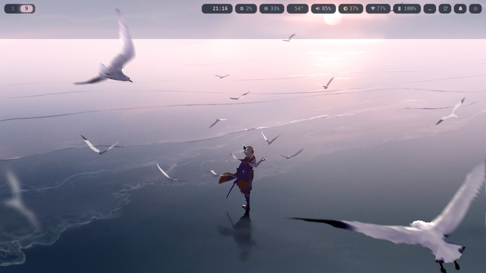
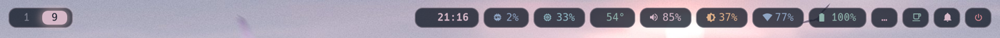
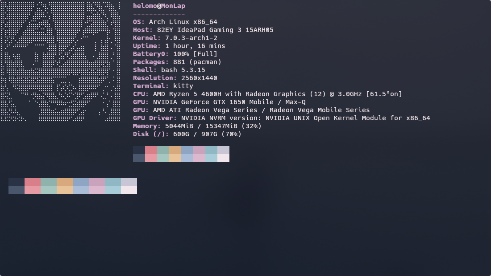
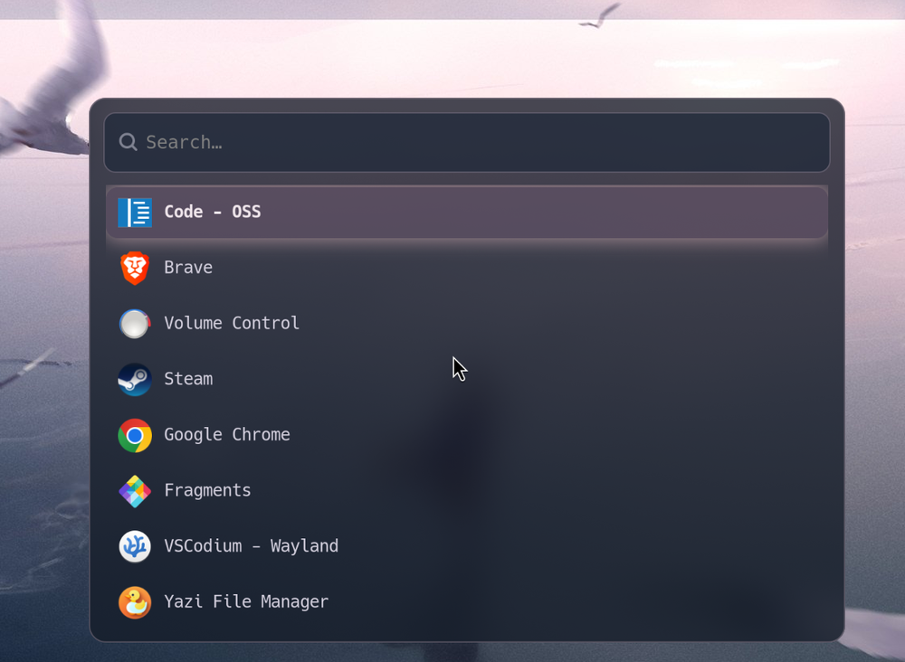
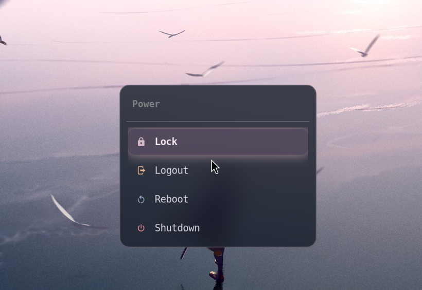
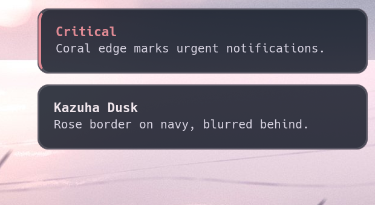
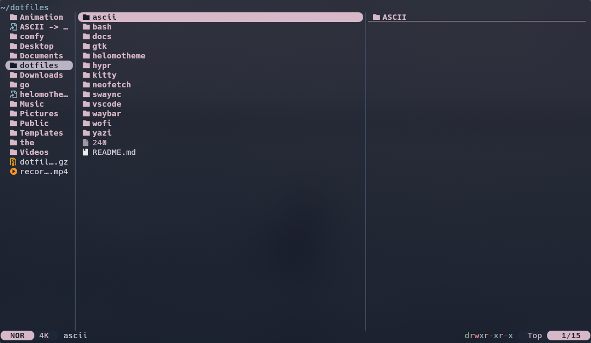
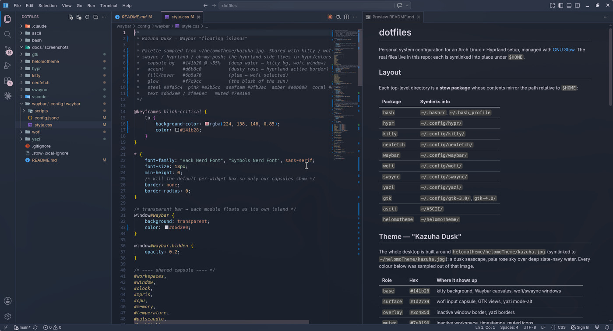

# dotfiles

Personal system configuration for an Arch Linux + Hyprland setup, managed with
[GNU Stow](https://www.gnu.org/software/stow/). The real files live in this repo;
each is symlinked into place under `$HOME`.





## Layout

Each top-level directory is a **stow package** whose contents mirror the path
relative to `$HOME`:

| Package       | Symlinks into                     |
|---------------|-----------------------------------|
| `bash`        | `~/.bashrc`, `~/.bash_profile`    |
| `hypr`        | `~/.config/hypr/`                 |
| `kitty`       | `~/.config/kitty/`                |
| `neofetch`    | `~/.config/neofetch/`             |
| `waybar`      | `~/.config/waybar/`               |
| `wofi`        | `~/.config/wofi/`                 |
| `swaync`      | `~/.config/swaync/`               |
| `yazi`        | `~/.config/yazi/`                 |
| `gtk`         | `~/.config/gtk-3.0/`, `gtk-4.0/`  |
| `vscode`      | `~/.config/{Code - OSS,VSCodium,Code}/User/` |
| `ascii`       | `~/ASCII/`                        |
| `helomotheme` | `~/helomoTheme/`                  |

## Theme — "Kazuha Dusk"

The whole desktop is built around `helomotheme/helomoTheme/kazuha.jpg` (symlinked to
`~/helomoTheme/kazuha.jpg`): a dusk seascape, pale rose sky over deep slate-navy water.
Every colour below was sampled out of that image.

| Role | Hex | Where it shows up |
|---|---|---|
| `base` | `#141b28` | kitty background, Waybar capsules, wofi/swaync windows |
| `surface` | `#1d2739` | wofi input capsule, GTK views, yazi mode-alt |
| `overlay` | `#3c485d` | inactive window border, yazi borders |
| `muted` | `#7e8190` | inactive workspace, timestamps, muted icons |
| `subtext` | `#a098a9` | hyprlock secondary text |
| `text` | `#d6d2e0` | primary text everywhere |
| `bright` | `#f0e6ec` | hovered / selected text |
| **`rose`** | **`#d6b8c8`** | **the accent** — active border, active workspace, clock, caret, prompt |
| `mauve` | `#b9b3c4` | border gradient's second stop, mpris |
| `blush` | `#f7c9cc` | the glow on hover / focus |
| `plum` | `#6b5a70` | selection fill (wofi rows, Waybar hover) |
| `steel` | `#8fa5c4` | blue — cpu, network, urls |
| `sky` | `#a9b8d4` | window title |
| `seafoam` | `#8fb3ac` | green — battery ok, temperature |
| `teal` | `#8fb8c4` | memory, yazi cwd |
| `amber` | `#e0b088` | yellow — backlight, battery warning |
| `coral` | `#e08a94` | red — critical states, power glyph |
| `pink` | `#e3b5cc` | urgent workspace, language |

`hypr/.config/hypr/colors.conf` is the source of truth for Hyprland and hyprlock —
both `source` it, so a colour changes in one place. The CSS-based apps (waybar, wofi,
swaync, gtk) and kitty can't read a hyprlang file, so their palettes are kept in step
by hand against this table.

Two colours are written in non-obvious formats and are easy to miss when retheming:
Hyprland uses hex-with-alpha and **no leading `#`** (`rgba(d6b8c8ee)`), and neofetch
uses the **ANSI-256 index** `182`, not a hex value.

### The pieces

**Terminal** — kitty, with the full 16-colour ANSI palette and oh-my-posh/neofetch on
the same values:



**Launcher and power menu** — wofi, sharing the Waybar island idiom and frosted by a
Hyprland `layerrule`:





**Notifications** — swaync, styled in GTK CSS so it matches Waybar exactly; critical
notifications get the coral edge:



**File manager** — yazi, with rose directories, teal symlinks and amber media:



**Editor** — VS Code / VSCodium, with the same terminal palette in its integrated
terminal:



### Transparency

kazuha.jpg has a very bright sky, so surfaces need more opacity than a dark wallpaper
would. Everything sits at **0.78–0.85** and gets Hyprland's blur behind it:

| Surface | Alpha | Set in |
|---|---|---|
| Waybar capsules | 0.78 | `waybar/style.css` |
| kitty background | 0.78 | `kitty.conf` (`background_opacity`) |
| GTK app windows | 0.78 | `gtk/…/gtk.css` (rgba in the surface colours) |
| GTK popovers / dialogs | 0.96 | as above — they float *over* a translucent window |
| wofi / swaync panels | 0.85 | their `style.css` |
| Firefox | 0.95 focused / 0.85 not | `hyprland.conf` windowrule |
| VS Code / VSCodium | 0.97 focused / 0.90 not | `hyprland.conf` windowrule |

For kitty and the GTK apps only the *background* carries alpha, so text stays fully
opaque. Firefox and VS Code are the exceptions — a web page paints its own opaque
background, and Electron has no background-transparency support at all, so the only
lever is window opacity, which dims the content too. Hence their much higher values:
at kitty's 0.78 a white page washes out and every syntax colour goes muddy.

Note that GTK reloads `gtk.css` live, so edits apply to already-running apps.

## Bootstrap on a new machine

```sh
sudo pacman -S stow          # if not already installed
sudo pacman -S swaync        # notification daemon (replaces hyprnotify)
git clone https://github.com/helomo/helomo-theme.git ~/dotfiles
cd ~/dotfiles
stow */                      # or list packages: stow bash hypr kitty ...
```

Stow's default target is the parent directory (`~`), so run it from `~/dotfiles`.

## Usage

```sh
cd ~/dotfiles
stow <package>      # create symlinks for a package
stow -D <package>   # remove symlinks (unstow)
stow -R <package>   # restow (remove + recreate)
stow -nv <package>  # dry-run, show what would happen
```

Edit any config through its normal path (e.g. `~/.bashrc`) — you're editing the
versioned file via its symlink. Commit changes from `~/dotfiles`.
